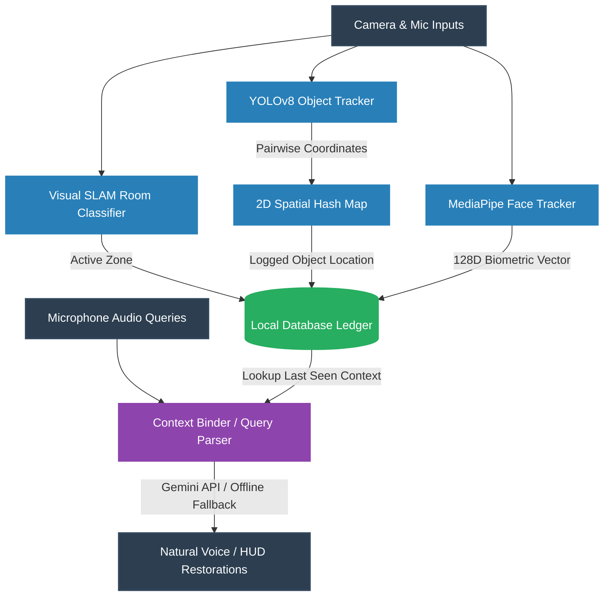

<!-- <p align="center">
  
</p> -->

<h1 align="center">⚓ Anchor</h1>

<p align="center">
  <b>An Autonomous External Hippocampus for Alzheimer's & Context Restoration Wearables</b>
</p>

<p align="center">
  
  
  
  
  
  
</p>

---

## 🚨 The Challenge: Cognitive & Context Deficits

Alzheimer’s disease and other forms of dementia systematically strip away a patient's immediate context, locking them into repetitive loops of disorientation. Caregivers face high burnout rates, and 24/7 specialized care is financially out of reach for underserved communities. 

Anchor targets the three primary deficits:
- **The Intent Deficit**: Forgetting why they walked into a room (leading to immediate disorientation and distress).
- **The Object Deficit**: Continuously misplacing vital daily items (keys, phone, glasses), which creates cyclic anxiety loops.
- **The Identity Deficit**: Failing to recognize family members and close contacts, leading to social withdrawal and shame.

---

## 💡 The Solution: An Autonomous External Hippocampus

**Anchor** acts as a zero-friction, always-on external memory bank. Designed for future AR Smart Glasses (simulated currently via a lanyard-worn smartphone proxy), the system passively captures audio-visual inputs, monitors rooms, indexes high-value everyday items, and binds faces to relationships. When the user faces context lapses, Anchor proactively whispers context clues via discrete spatial audio, requiring **zero** technical interaction from the patient.

---

## ✨ Core Pillars & How It Works



### 👤 1. Identity Anchoring & Face Mesh Mapping
- **Local Face Geometry**: Uses **MediaPipe FaceMesh** to extract landmarks from camera frames. Unlike traditional libraries that compile heavy C++ frameworks (like `dlib`), MediaPipe runs natively on lightweight platforms.
- **128D Geometric Embeddings**: Computes a deterministic, translation-, scale-, and rotation-invariant 128-dimensional biometric signature by measuring scale-normalized pairwise Euclidean distances between 16 key facial landmarks (eyes, mouth, nose, chin, cheeks). 
- **Unsupervised Face Binding**: When an unknown face approaches, the system activates the ambient microphone to record greetings. It uses **Google Gemini** (or offline local regex heuristics) to extract names and relationships (e.g., *"Hi Grandpa, it's Sarah"*) and binds that identity metadata to the face vector in the local database.

### 🔍 2. Passive Object Tracking (The Visual Ledger)
- **Edge Object Detection**: Runs **YOLOv8-nano** to detect daily high-value targets (cell phone, keys, glasses, wallet, backpack, laptop).
- **2D Spatial Hashing**: Employs a custom `SpatialHashMap` to divide the visual frame into grid cells. These coordinates are mapped to descriptive local zones (e.g., `"top-right area"`, `"center area"`) and logged in the database along with the active room.

### 🏠 3. Room Classification & Hysteresis Transitions
- **Visual SLAM**: The `MemoraSpatialSLAM` module classifies room locations based on visual HSV signature matching. 
- **Hysteresis Filtering**: Employs a signal transition threshold to prevent room flickering. Supports manual transitions to simulate BLE (Bluetooth Low Energy) beacon zone updates.

### 🎙️ 4. Conversational Context Queries
- **Natural Voice Search**: When a user presses the query key, the `MemoraAudioListener` records the voice question (e.g., *"Where did I leave my phone?"*).
- **Intelligent Query Mapping**: The context engine parses the query, maps it to tracked database items, calculates the time elapsed, and whispers a natural retrieval response:
  > 🔊 *"Your cell phone was last seen in the Bathroom (top-right area) 3 minutes ago."*

---

## 🛠️ Technology Stack

- **Platform Support**: Native Apple Silicon macOS (ARM64) and Linux/Raspberry Pi.
- **Language**: Python 3.11
- **Computer Vision**: OpenCV-Python & MediaPipe 0.10.14
- **Edge Machine Learning**: Ultralytics YOLOv8-nano
- **Speech Processing**: SpeechRecognition & PyAudio (PortAudio)
- **Generative AI**: Google Gemini API (`google-generativeai`)
- **Database & State**: Thread-safe Local JSON Storage (`MemoraDatabase`)
- **Environment**: python-dotenv

---

## 📂 Repository Structure

```text
Anchor
├── config/
│   └── settings.py          # Unified system configuration and thresholds
├── core/
│   ├── audio_listener.py    # PyAudio/SpeechRecognition interface
│   ├── context_binder.py    # Gemini API context binding and query parsing
│   ├── database.py          # Thread-safe persistent JSON database
│   ├── face_recognizer.py   # MediaPipe FaceMesh biometric mapping
│   ├── object_ledger.py     # YOLOv8 passive object tracking & Spatial Hash Map
│   └── spatial_slam.py      # Room classification and hysteresis SLAM transitions
├── assets/
│   └── banner.png           # Visual branding assets
├── demo_week1.py            # Phase 1: Identity binding and microphone matching
├── demo_week2.py            # Phase 2: Object ledger and voice search queries
├── requirements.txt         # Package configuration
└── README.md                # Documentation
```

---

## 🚀 Installation & Setup

### Prerequisites (macOS Homebrew)
If compiling PortAudio on Apple Silicon, ensure PortAudio is installed via Homebrew and exported to your compiler flags:
```bash
# Install audio compiler dependencies
brew install portaudio

# Export compile paths for PyAudio (ARM64 Mac)
export LDFLAGS="-L/opt/homebrew/lib"
export CPPFLAGS="-I/opt/homebrew/include"
```

### Install Dependencies
```bash
# Clone the repository
git clone https://github.com/AayushAade/Samsung_Anchor.git
cd Samsung_Anchor

# Create a virtual environment using Python 3.11
python3.11 -m venv venv
source venv/bin/activate

# Upgrade packaging tools
pip install --upgrade pip setuptools wheel

# Install dependencies
pip install -r requirements.txt
```

### Configure Environment Variables
Create a `.env` file in the root directory:
```env
GEMINI_API_KEY=your_google_gemini_api_key_here
```
*Note: If no API key is specified, the system automatically falls back to local regex-based heuristic parsing and continues working fully offline.*

---

## 🎮 Running the Demos

Anchor includes a fully integrated simulation system (`--mock`) to test all pipelines without physical cameras or audio recording hardware.

### Week 1: Identity Binding Demo
Learns face features and queries audio logs to bind names:
```bash
# Run in simulated mode
python demo_week1.py --mock

# Run in real webcam mode
python demo_week1.py
```

### Week 2: Passive Object Tracking & Voice Search Demo
Tracks objects, switches rooms, and answers query questions:
```bash
# Run in simulated mode
python demo_week2.py --mock

# Run in real camera mode
python demo_week2.py
```

#### Week 2 Interactive Controls:
- **Press `f`**: Start the audio query listener. Speak *"Where is my phone?"* or *"Where are my keys?"* to query the database.
- **Press `r`**: Simulate a room transition (toggles between Living Room, Kitchen, Bedroom, Bathroom) to test spatial logging.
- **Press `q`**: Exit the program and save database state.

---

## 🔬 Running Unit Tests
A comprehensive test suite validates all components, including databases, query parsers, and neural models:
```bash
python3 -m unittest discover tests
```

---

## 🗺️ Roadmap

- [x] **Phase I**: Identity binding & relationship deduction from conversation audio logs (Week 1 MVP).
- [x] **Phase II**: YOLOv8-nano visual ledger, room transition classifications, and voice search retrieval (Week 2 MVP).
- [ ] **Phase III**: Epistemic relationship graph and temporal/episodic memory mapping.
- [ ] **Phase IV**: Wearable smart glasses migration (Samsung XR integration) and on-device offline LLM compilation.