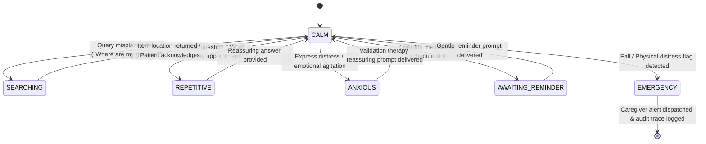

# MEMORA (Samsung Anchor) — Appendices, Class Index & State Diagrams

This document provides system appendices, complete class indexes, configuration references, state transition diagrams, and sequence flows for MEMORA (Samsung Anchor) Release Candidate RC1.

---

## PART 16 — APPENDICES & TECHNICAL REFERENCE

### 1. Glossary & Acronyms
- **MCI**: Mild Cognitive Impairment.
- **HAL**: Hardware Abstraction Layer.
- **FAISS**: Facebook AI Similarity Search (128D L2 vector index).
- **EMA**: Exponential Moving Average (embedding reinforcement).
- **IoU**: Intersection over Union (spatial bounding box overlap metric).
- **VAD**: Voice Activity Detector.
- **RC1**: Release Candidate Build 1.
- **Pub-Sub**: Publish-Subscribe Event Bus design pattern.

---

### 2. Complete Repository Directory Map

```
Samsung_Anchor/
├── app.py                                   # Official CLI Entry Point & Bootstrap
├── config/
│   ├── constants.py                         # System thresholds & defaults
│   ├── paths.py                             # Directory paths
│   └── settings.py                          # Global runtime settings & OpenMP env vars
├── devices/
│   ├── camera.py                            # Camera Device Wrapper
│   ├── microphone.py                        # Microphone Device Wrapper
│   └── speaker.py                           # Speaker Device Wrapper
├── experience/
│   ├── server.py                            # HTTP & WebSockets Experience Server (port 8765)
│   └── static/                              # HTML / JS / CSS Dashboard UI
├── src/
│   ├── application/
│   │   └── factory.py                       # App Construction Factory (build_application)
│   ├── audio/
│   │   ├── audio_listener.py                # PyAudio Microphone HAL & Listener
│   │   └── speaker.py                       # Native PyTTSx3 Text-to-Speech Adapter
│   ├── clinical/
│   │   ├── appointment_manager.py           # Appointment Schedule Manager
│   │   ├── audit_logger.py                  # Clinical Audit Logging Engine
│   │   ├── care_policy.py                   # CarePolicyFramework & CarePrinciple Enums
│   │   ├── caregiver_manager.py             # Caregiver Profile Repository
│   │   ├── consent_manager.py               # Patient Consent Preferences Manager
│   │   ├── decision_trace.py                # ClinicalDecisionTrace Logger
│   │   ├── emergency_manager.py             # Emergency Alert & Fall Escalation
│   │   ├── explainability.py                # Explainability Rationale Generator
│   │   ├── medication_manager.py            # Missed Dose Schedule Manager
│   │   ├── patient_profile.py               # Patient Demographics Profile
│   │   ├── patient_state.py                 # PatientStateEvaluator & PatientStateMode
│   │   └── scenario_validator.py            # 10 Clinical Scenarios Validation Harness
│   ├── cognition/
│   │   ├── context_restorer.py              # Temporal & Identity Context Restorer
│   │   ├── cue_manager.py                   # Goal Hypotheses Cue Manager
│   │   ├── episode_engine.py                # Daily Episode Consolidation Engine
│   │   └── episode_repository.py            # Episode SQLite Repository
│   ├── conversation/
│   │   ├── conversation_manager.py          # Strategic Dialogue Manager
│   │   ├── conversation_policy.py           # Dialogue Policy Rules
│   │   ├── response_planner.py              # Patient-Centered Response Planner
│   │   └── turn_manager.py                  # Dialogue Turn Manager
│   ├── core/
│   │   ├── cognitive_stream.py              # WebSockets Cognitive Stream Broadcaster
│   │   └── event_bus.py                     # Thread-Safe EventBus Pub-Sub
│   ├── hardware/
│   │   ├── camera_adapter.py                # Physical OpenCV Camera HAL Adapter
│   │   ├── microphone_adapter.py            # Physical PyAudio Microphone HAL Adapter
│   │   └── speaker_adapter.py               # Native Speaker HAL Adapter
│   ├── interaction/
│   │   ├── actions.py                       # InteractionAction (SPEAK, SILENCE, ESCALATE)
│   │   ├── events.py                        # Interaction Event Specifications
│   │   ├── interaction_manager.py          # Action Suppression & Silence Filter
│   │   └── presence_engine.py               # 500ms Steady Face Gating Engine
│   ├── memory/
│   │   ├── database.py                      # SQLAlchemy ORM Database Manager
│   │   └── vector_store.py                  # Thread-Locked FaissVectorStore (128D)
│   ├── perception/
│   │   ├── activity_detector.py             # Patient Activity Classifier
│   │   ├── audio_pipeline.py                # Acoustic Audio Processing Pipeline
│   │   ├── camera_pipeline.py               # Camera Stream Capture Pipeline
│   │   ├── face_tracker.py                  # Spatial Face Track Manager
│   │   ├── multimodal_fusion.py             # ContextFusionEngine & 6 Providers
│   │   ├── object_detector.py               # YOLO & Room Heuristic Object Detector
│   │   ├── perception_manager.py            # Perception Processing Manager
│   │   ├── room_tracker.py                  # Room Spatial Boundary Tracker
│   │   ├── sensor_models.py                 # Perception Sensor Models (DetectedFace)
│   │   ├── speech_recognition_engine.py     # Speech Transcript Engine
│   │   ├── visual_memory_engine.py          # Honest Visual Episodic Memory Engine
│   │   └── voice_activity_detector.py       # Acoustic VAD Engine
│   ├── pipeline/
│   │   └── cognitive_pipeline.py            # 10-Stage Cognitive Pipeline Execution Engine
│   ├── reasoning/
│   │   └── context_binder.py                # Gemini Multimodal LLM & Local Fallback
│   ├── runtime/
│   │   ├── camera_adapter.py                # Duck-typing CameraAdapter (.read())
│   │   └── runtime.py                       # AnchorRuntime Manager & Signal Handlers
│   ├── services/
│   │   └── identity_learning_service.py     # Identity Learning Pipeline
│   ├── utils/
│   │   └── event_logger.py                  # Formatted Console Event Logger
│   └── vision/
│       └── face_recognizer.py               # Thread-Locked MemoraFaceRecognizer (dlib/SCRFD/MediaPipe)
├── tests/                                   # 174 Automated Unit & Integration Tests
└── docs/                                    # Official Engineering Documentation Suite
```

---

### 3. Patient State Transition Diagram



---

### 4. System Class Index

| Class Name | Module Path | Purpose |
| :--- | :--- | :--- |
| `AnchorCoordinator` | `src.coordinator.anchor_coordinator` | Central orchestration manager & worker thread host. |
| `AnchorRuntime` | `src.runtime.runtime` | Continuous runtime execution & signal trapping manager. |
| `MemoraFaceRecognizer` | `src.vision.face_recognizer` | Multi-backend face recognizer & persistent spatial tracker. |
| `FaissVectorStore` | `src.memory.vector_store` | Thread-locked 128D FAISS similarity vector index. |
| `VisualEpisodicMemoryEngine` | `src.perception.visual_memory_engine` | Honest object location query resolution engine. |
| `PatientStateEvaluator` | `src.clinical.patient_state` | Real-time patient state inference state machine. |
| `CarePolicyFramework` | `src.clinical.care_policy` | Clinical dementia care policy governance framework. |
| `ClinicalDecisionTraceLogger` | `src.clinical.decision_trace` | Clinical decision trace construction & WebSocket logger. |
| `MemoraDatabase` | `src.memory.database` | SQLAlchemy ORM memory database & repository manager. |
| `ClinicalScenarioValidator` | `src.clinical.scenario_validator` | 10 clinical scenario validation harness. |
