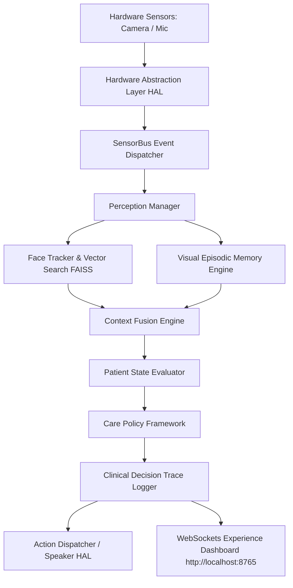
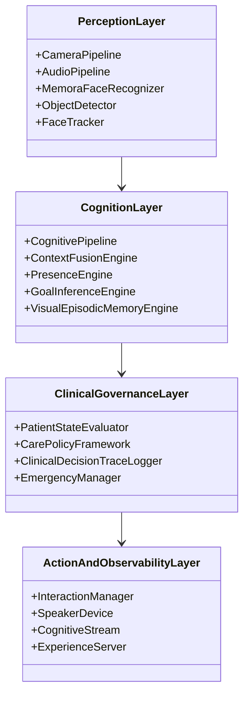
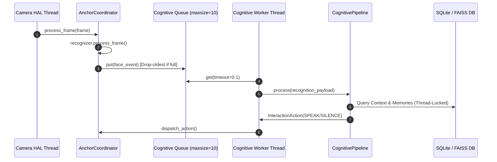
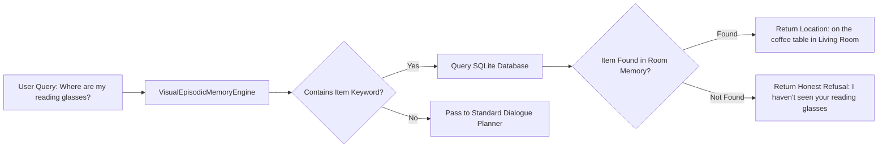

# MEMORA (Samsung Anchor) — System Architecture & Data Flow Specification

This document provides the definitive architectural reference for MEMORA (Samsung Anchor) Release Candidate RC1.

---

## PART 2 — SYSTEM ARCHITECTURE

### 1. High-Level Architecture
MEMORA is structured as a decoupled, event-driven 4-tier pipeline:
1. **Perception Layer (Edge HAL & Vision/Audio Pipelines)**: Captures video frames and audio chunks, performs face recognition, object tracking, and voice activity detection.
2. **Cognitive & Memory Layer (Context Fusion & SQLite/FAISS)**: Fuses spatial, temporal, social, and visual memory providers into a unified `CognitiveContext`.
3. **Clinical Governance Layer (Patient State & Care Policy)**: Evaluates patient emotional/cognitive state and selects non-confrontational dementia care policies.
4. **Action & Observability Layer (Speaker Dispatch & Dashboard)**: Executes audio speech output and streams structured `ClinicalDecisionTrace` events over WebSockets.



---

### 2. Layered Architecture



---

### 3. Runtime & Concurrency Architecture

To guarantee that heavy cognitive reasoning never blocks physical camera frame acquisition, MEMORA utilizes a multi-threaded asynchronous worker pattern:



---

## PART 4 — DATA FLOW SPECIFICATION

### 1. Primary Perception-to-Action Signal Flow

```
[Raw Frame / Audio Chunk]
           │
           ▼
[1. Hardware Adapter (.read())]
           │
           ▼
[2. SensorBus Event ("face_detected")]
           │
           ▼
[3. Bounded Queue (maxsize=10)]  ──► [Drop-Oldest Strategy if full]
           │
           ▼
[4. PerceptionManager] ──► Updates FaceTracker & RoomTracker
           │
           ▼
[5. ContextFusionEngine] ──► Consolidates Identity, Memory, Temporal Context
           │
           ▼
[6. PatientStateEvaluator] ──► Infers Mode (ORIENTED/SEARCHING/ANXIOUS/EMERGENCY)
           │
           ▼
[7. CarePolicyFramework] ──► Enforces Principles (Validation Therapy, One-Step)
           │
           ▼
[8. Visual Memory Recall] ──► Honest location lookup for misplaced items
           │
           ▼
[9. ClinicalDecisionTrace] ──► Logs trace & emits event over WebSocket
           │
           ▼
[10. Speaker HAL] ──► Dispatches audio speech output
```

---

### 2. Identity & Vector Memory Flow

1. **Detection**: Bounding box extracted by SCRFD, dlib, or MediaPipe.
2. **Embedding**: 128-dimensional floating point vector computed.
3. **Similarity Search**: `FaissVectorStore.find_match(query, tolerance=0.6)` executed under `threading.Lock`.
4. **Temporal Consensus**: Candidate identity must maintain match stability for `N=3` consecutive frames (`required_consensus_frames`).
5. **Reinforcement**: Exponential Moving Average (EMA) update applied to confirmed embeddings.

---

### 3. Visual Episodic Memory Recall Flow


