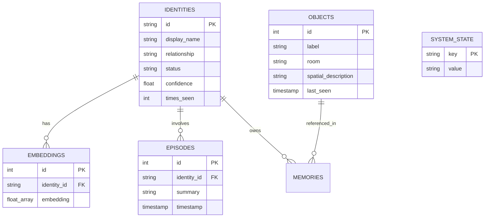

# MEMORA (Samsung Anchor) — Clinical Design & Database Schema Specification

This document details the clinical rationale, dementia care frameworks, explainability engine, and database schema for MEMORA (Samsung Anchor) Release Candidate RC1.

---

## PART 7 — CLINICAL DESIGN PHILOSOPHY

### 1. Why Patient State & Care Policy Exist
Dementia causes progressive deterioration of executive function, short-term memory, and spatial orientation. Generic voice assistants fail in dementia care environments because they lack **clinical empathy** and **state awareness**.

MEMORA introduces a deterministic **Patient State Evaluator** (`PatientStateEvaluator`) and **Care Policy Framework** (`CarePolicyFramework`). By categorizing real-time patient state into distinct clinical modes (`ORIENTED`, `SEARCHING`, `REPETITIVE`, `ANXIOUS`, `EMERGENCY`), MEMORA tailors its interaction style to match the patient's immediate cognitive needs.

---

### 2. Core Clinical Care Principles

#### Validation Therapy (`CarePrinciple.VALIDATION_THERAPY`)
- **Clinical Rationale**: Developed by Naomi Feil, Validation Therapy emphasizes empathy and emotional agreement rather than reality orientation for disoriented individuals. Correcting or arguing with a person living with dementia increases cortisol levels, catastrophic reactions, and acute anxiety.
- **MEMORA Implementation**: When a patient asks an emotionally loaded or disoriented question ("Why am I forgetting things?", "Where is my mother?"), MEMORA validates the underlying emotion ("You are safe here, Eleanor. I am right by your side.") rather than arguing about memory loss.

#### One-Step Guidance (`CarePrinciple.ONE_STEP_GUIDANCE`)
- **Clinical Rationale**: Impaired executive processing renders multi-step commands incomprehensible.
- **MEMORA Implementation**: All generated prompts are strictly limited to a single, concrete step (e.g., "Your reading glasses are on the coffee table.").

#### Supportive Silence (`CarePrinciple.SUPPORTIVE_SILENCE`)
- **Clinical Rationale**: Excessive auditory stimulation increases cognitive fatigue and confusion.
- **MEMORA Implementation**: When the patient is calm and oriented, MEMORA suppresses audio speech output, remaining silently observant until a cue or safety event occurs.

#### Repetitive Redirection (`CarePrinciple.REPETITIVE_REDIRECTION`)
- **Clinical Rationale**: Patients with short-term memory loss frequently repeat the same question dozens of times daily. Expressing impatience exacerbates distress.
- **MEMORA Implementation**: MEMORA delivers identical, calm, reassuring answers to repeated questions without scolding or modifying its tone.

#### Emergency Escalation (`CarePrinciple.EMERGENCY_ESCALATION`)
- **Clinical Rationale**: Physical falls or unacknowledged distress require immediate caregiver intervention.
- **MEMORA Implementation**: Bypasses conversational dialogue, generates an alert payload, and logs an urgent audit trace.

---

## PART 5 — DATABASE SCHEMA & PERSISTENCE

MEMORA uses SQLite with SQLAlchemy ORM (`MemoraDatabase`) stored locally at `database.db` (or `database_v2.sqlite`).

---

### Database Tables & Retention Specifications

1. **`identities`**: Stores recognized patient and family member profiles (`id`, `display_name`, `relationship`, `status`, `confidence`).
2. **`objects`**: Stores visual item memory tuples (`label`, `room`, `spatial_description`, `last_seen`).
3. **`episodes`**: Stores consolidated daily interaction episodes (`summary`, `timestamp`).
4. **`memories`**: Stores structured semantic facts and caregiver instructions.
5. **`system_state`**: Stores system key-value pairs (`current_room`, `next_anon_index`).

**Data Retention Policy**:
- Image frame arrays are discarded immediately after embedding extraction.
- Audio raw streams are processed in memory and never saved to disk.
- SQLite database tables maintain persistent local histories across system reboots.
