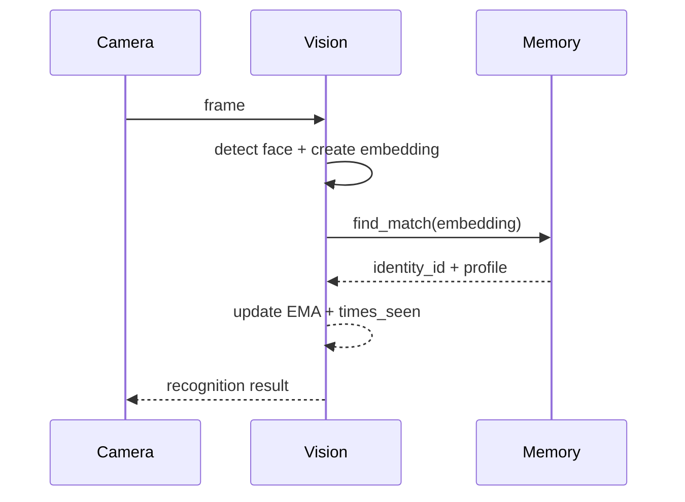
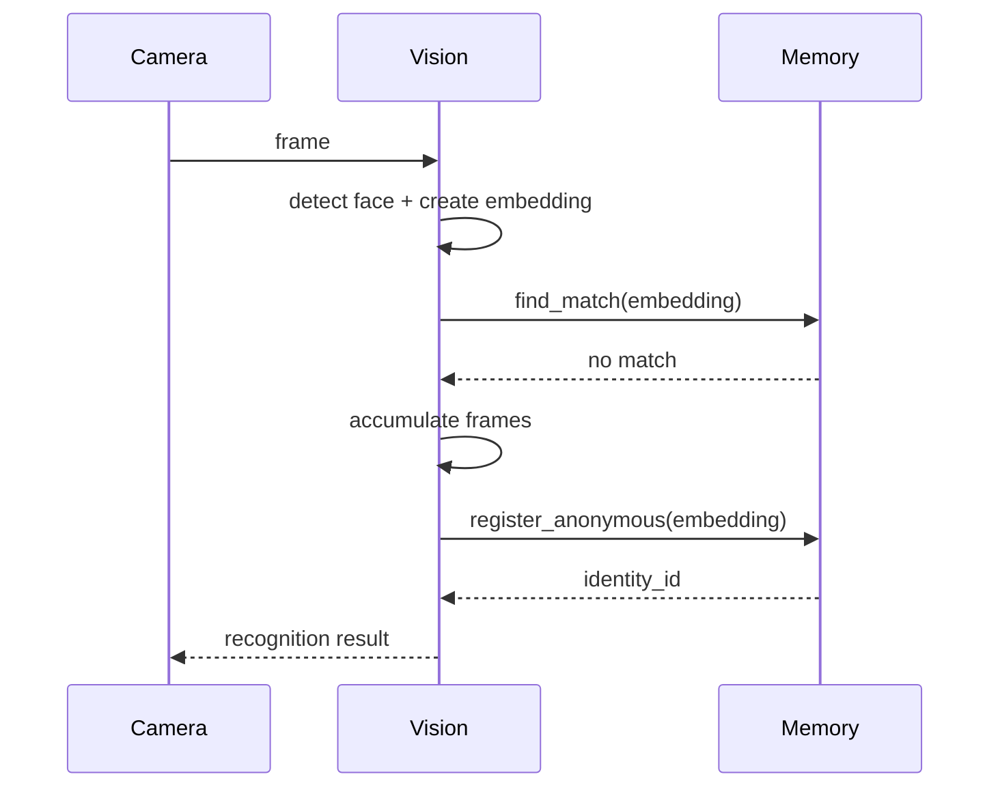
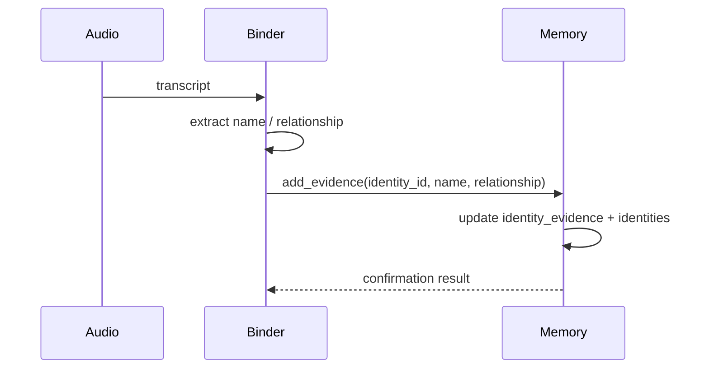
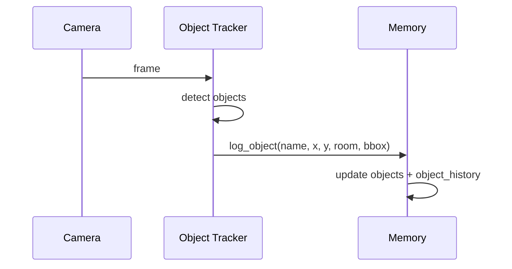

# Vision ↔ Memory Integration Deep Dive

## 1. High-Level Architecture

### Overall responsibility of Vision
The Vision subsystem is responsible for sensing the camera stream, detecting faces, generating embeddings, associating detections over time, and producing identity-level results that can be handed to the Memory layer.

In the current repository, the active implementation is in [src/vision/face_recognizer.py](src/vision/face_recognizer.py). Its main role is to analyze frames and decide whether a detected face is:

- a known identity,
- a new anonymous identity,
- or an unknown candidate still in the stabilization phase.

### Overall responsibility of Memory
The Memory subsystem is responsible for persistent storage and retrieval of identity-related state, evidence, object sightings, and room state. The active implementation is split between:

- [src/memory/database.py](src/memory/database.py) for SQLite-backed persistence and identity/object memory
- [src/memory/object_ledger.py](src/memory/object_ledger.py) for spatial object indexing and tracker state

### Why these two modules communicate
They communicate because Vision creates transient observations, while Memory turns those observations into durable state. Vision can detect a face, but it needs Memory to:

- compare the embedding against previously seen identities,
- create a new identity record if none exists,
- reinforce an existing identity with additional embeddings,
- store evidence and confidence updates,
- and persist object sightings and their last-known location.

### Current maturity of the integration
The integration is partially implemented and functional at a prototype level.

It is mature in these areas:

- face embedding lookup and identity registration
- anonymous identity creation
- embedding reinforcement and EMA updates
- basic object logging into SQLite

It is incomplete in these areas:

- full end-to-end identity confirmation from audio and vision together
- a polished object-tracking memory API
- a production-ready configuration layer
- a fully wired application entrypoint that uses the current module layout consistently

### Which module owns which responsibility

- Vision owns perception and feature extraction.
- Memory owns persistence and stateful identity/object recall.
- Vision should not own the canonical record lifecycle beyond producing candidate results.
- Memory should not own camera capture or frame processing.

### Which module initiates communication
Vision initiates communication. The current flow is driven by `MemoraFaceRecognizer.process_frame(...)`, which calls into the Memory layer during matching and registration.

### Which module consumes the result
Memory does not consume a visual result in the sense of “processing the frame”; instead, it consumes the result of the recognition pipeline as a request to create, update, or retrieve state.

The consumer is the recognition pipeline itself, which reads the Memory layer’s reply to decide whether an identity is known, unknown, or needs to be promoted.

### Architecture diagram

```text
Camera
  │
  ▼
Vision
  │
  ▼
Recognition Pipeline
  │
  ├─ Face Detection / Embedding Generation
  ├─ Similarity Matching
  └─ Identity Decision
        │
        ▼
Memory
  │
  ├─ Identity Lookup / Registration
  ├─ Embedding Storage
  ├─ Evidence / Confidence Updates
  └─ Object / Room Persistence
        │
        ▼
Reasoning / Audio / Future Extensions
```

---

## 2. Complete Vision Module Analysis

### File inventory

#### [src/vision/__init__.py](src/vision/__init__.py)
- Purpose: package marker for the Vision subsystem.
- Current implementation status: placeholder / empty package initializer.
- Classes: none.
- Functions: none.
- Public methods: none.
- Private methods: none.
- Dependencies: none.
- Imports: none.
- Exports: none.
- Files that call it: none found in the active current tree.
- Files it calls: none.

#### [src/vision/face_recognizer.py](src/vision/face_recognizer.py)
- Purpose: implement face detection, face embedding generation, track association, identity matching, and new-identity promotion.
- Current implementation status: fully implemented as a prototype-level recognition pipeline with multiple backend fallbacks.
- Classes:
  - `MemoraFaceRecognizer`
  - `compute_iou`
- Functions:
  - `compute_iou(...)`
  - `MemoraFaceRecognizer.__init__(...)`
  - `MemoraFaceRecognizer._compute_geometric_embedding(...)`
  - `MemoraFaceRecognizer._update_missed_tracks(...)`
  - `MemoraFaceRecognizer.process_frame(...)`
  - `MemoraFaceRecognizer.draw_faces(...)`
- Public methods:
  - `MemoraFaceRecognizer.__init__(...)`
  - `MemoraFaceRecognizer.process_frame(...)`
  - `MemoraFaceRecognizer.draw_faces(...)`
- Private methods:
  - `MemoraFaceRecognizer._compute_geometric_embedding(...)`
  - `MemoraFaceRecognizer._update_missed_tracks(...)`
- Dependencies:
  - `cv2`
  - `numpy as np`
  - `time`
  - `os`
  - `config.settings`
  - `core.event_logger.log_event`
  - optional `face_recognition`
  - optional `insightface`
  - optional `mediapipe`
- Imports:
  - `import cv2`
  - `import numpy as np`
  - `import time`
  - `import os`
  - `from config import settings`
  - `from core.event_logger import log_event`
- Exports: none explicitly exported; the class is imported by demos and likely by the application in the future.
- Files that call it:
  - [archive/week1/demo_week1.py](archive/week1/demo_week1.py)
- Files it calls:
  - [src/memory/database.py](src/memory/database.py) via `database.register_anonymous(...)`, `database.find_match(...)`, `database.get_identity(...)`, `database.update_embedding_ema(...)`, `database.increment_times_seen(...)`
  - [src/utils/event_logger.py](src/utils/event_logger.py) via `log_event(...)`

---

## 3. Recognition Pipeline

This section documents the actual flow from camera frame to memory-backed identity state.

### Step 1: Frame arrival
The entry point is `MemoraFaceRecognizer.process_frame(frame, database)`.

The method expects:

- a BGR OpenCV frame,
- and a `database` object implementing the Memory API.

If `frame` is `None`, it returns immediately.

### Step 2: Backend selection
`MemoraFaceRecognizer.__init__(...)` chooses a backend in this order:

1. `face_recognition` if the package is installed
2. `insightface` if installed
3. `mediapipe` if installed
4. otherwise mock mode

The selected backend determines how faces are found and how embeddings are generated.

### Step 3: Face detection
The actual detection implementation differs by backend.

#### Mock backend
- Creates a synthetic face box based on frame dimensions.
- Computes a simple embedding from the average color of the face region.
- Returns one synthetic detection.

#### `face_recognition` backend
- Converts the frame from BGR to RGB.
- Uses `face_recognition.face_locations(...)` for bounding boxes.
- Uses `face_recognition.face_encodings(...)` for 128D embeddings.

#### `mediapipe` backend
- Converts the frame to RGB.
- Runs `FaceMesh`.
- Extracts landmarks and computes a geometric embedding via `_compute_geometric_embedding(...)`.

### Step 4: Track association
After detections are found, the recognizer enters a track association phase.

It loops over current `self.active_tracks` and tries to match each detection to an existing track using:

- IoU of bounding boxes via `compute_iou(...)`
- center-point distance

If a detection is associated with an existing active track, the track is updated in place.

### Step 5: Unknown candidate stabilization
If a detection does not match an existing track, a new track is created as an unknown candidate.

For non-mock backends, the track starts in the state `UNKNOWN` and accumulates embeddings over frames.

### Step 6: Promotion to anonymous identity
When a track reaches 15 stable frames, the recognizer promotes it into the database:

- `database.register_anonymous(avg_embedding)`
- `database.get_identity(new_id)`
- it then creates a new active track keyed by the new identity ID

This is the actual point where an unknown face becomes a stored identity in Memory.

### Step 7: Memory lookup for existing faces
When a detection is associated with an existing track, the system attempts a lookup:

- `database.find_match(det["embedding"], self.tolerance)`

If a match is found, the recognizer:

- updates the embedding using EMA via `database.update_embedding_ema(...)`
- increments the identity visit count via `database.increment_times_seen(...)`

### Step 8: Result object creation
The recognizer builds a result dictionary for each detection. The important fields are:

- `box`
- `face_id`
- `name`
- `relationship`
- `is_new`
- `embedding`
- optionally `label`

### Step 9: Missed track handling
Tracks that are not seen for too long are removed from `self.active_tracks`.

This is done by `_update_missed_tracks(...)`.

### End-to-end flow summary

```text
Camera Frame
  ↓
Backend Detection
  ↓
Bounding Box + Embedding
  ↓
Track Association
  ↓
Known Track? / New Track?
  ↓
Database Lookup via find_match(...)
  ↓
Known Identity Found?
  ├─ Yes → Update EMA + times_seen + return identity
  └─ No → Register anonymous identity after 15 stable frames
  ↓
Identity Stored in Memory
```

---

## 4. Data Objects

### 1. Face embedding
- Name: `embedding`
- Type: `numpy.ndarray` or Python list
- Fields: vector values
- Data types: floating point values
- Example values: a 128D vector generated by face recognition or a custom geometric vector
- Created in: `MemoraFaceRecognizer.process_frame(...)`
- Consumed in: `database.find_match(...)`, `database.register_anonymous(...)`, `database.add_embedding_to_identity(...)`, `database.update_embedding_ema(...)`

### 2. Identity ID
- Name: `identity_id`
- Type: `str`
- Fields: single identifier string
- Data types: string
- Example values: `Anonymous_ID_1`
- Created in: `MemoraDatabase.register_anonymous(...)`
- Consumed in: `MemoraFaceRecognizer.process_frame(...)`, `MemoraDatabase.get_identity(...)`, `MemoraDatabase.add_evidence(...)`

### 3. Bounding box
- Name: `box`
- Type: `tuple`
- Fields: `(top, right, bottom, left)`
- Data types: integers
- Example values: `(20, 180, 140, 90)`
- Created in: backend-specific detection logic
- Consumed in: IoU association and drawing

### 4. Center point
- Name: `center`
- Type: `tuple`
- Fields: `(cx, cy)`
- Data types: integers or floats
- Example values: `(135, 80)`
- Created in: detection logic
- Consumed in: track association and object tracking logic

### 5. Recognition result
- Name: result dictionary in `process_frame(...)`
- Type: `dict`
- Fields:
  - `box`
  - `face_id`
  - `name`
  - `relationship`
  - `is_new`
  - `embedding`
  - optional `label`
- Data types: mixed
- Example values: `{ "box": (...), "face_id": "Anonymous_ID_1", "name": None, "relationship": None, "is_new": True, "embedding": [...] }`
- Created in: `MemoraFaceRecognizer.process_frame(...)`
- Consumed in: the demo application loop and visualization logic

### 6. Evidence record
- Name: evidence payload passed to `add_evidence(...)`
- Type: `dict` or method arguments
- Fields: identity, name, optional relationship, optional raw transcript
- Data types: string / optional string
- Example values: `("Anonymous_ID_1", "Sarah", "Daughter", "Hi Sarah, it’s your daughter")`
- Created in: audio+reasoning flow
- Consumed in: `MemoraDatabase.add_evidence(...)`

### 7. Object detection result
- Name: detection entry in object tracker
- Type: `dict`
- Fields:
  - `name`
  - `box`
  - `confidence`
  - `center`
- Data types: mixed
- Example values: `{ "name": "keys", "box": (...), "confidence": 0.91, "center": (440, 160) }`
- Created in: `MemoraObjectTracker.detect_objects(...)`
- Consumed in: [archive/week2/demo_week2.py](archive/week2/demo_week2.py) and database logging

### 8. Timestamp
- Name: timestamps stored in database
- Type: `str`
- Fields: ISO 8601 string from `datetime.now().isoformat()`
- Data types: string
- Example values: `2026-07-04T13:24:59.793973`
- Created in: database methods
- Consumed in: history and last-seen queries

---

## 5. Vision API Inventory

### `compute_iou(boxA, boxB)`
- Parameters: two bounding box tuples
- Parameter types: `tuple`
- Return value: IoU score as `float`
- Return type: `float`
- Called by: `MemoraFaceRecognizer.process_frame(...)`
- Calls into: none
- Side effects: none
- Exceptions: none explicit; uses safe arithmetic
- Database interactions: none

### `MemoraFaceRecognizer.__init__(tolerance=settings.FACE_TOLERANCE, mock_mode=False)`
- Parameters: tolerance, mock_mode
- Parameter types: `float`, `bool`
- Return value: instance
- Return type: `MemoraFaceRecognizer`
- Called by: [archive/week1/demo_week1.py](archive/week1/demo_week1.py)
- Calls into: optional backend initialization
- Side effects: initializes internal state and optional backend objects
- Exceptions: none explicit; falls back to mock mode if backend initialization fails
- Database interactions: none

### `MemoraFaceRecognizer._compute_geometric_embedding(landmarks, w, h)`
- Parameters: landmarks object, width, height
- Parameter types: `object`, `int`, `int`
- Return value: geometric embedding vector
- Return type: `numpy.ndarray`
- Called by: `MemoraFaceRecognizer.process_frame(...)`
- Calls into: none
- Side effects: none
- Exceptions: none explicit
- Database interactions: none

### `MemoraFaceRecognizer._update_missed_tracks(now_time, database, associated_tracks=set())`
- Parameters: current time, database object, optional associated track IDs
- Parameter types: `float`, object, `set`
- Return value: none
- Return type: `None`
- Called by: `MemoraFaceRecognizer.process_frame(...)`
- Calls into: `database.get_identity(...)`
- Side effects: removes stale tracks and writes log events
- Exceptions: none explicit
- Database interactions: read-only (`get_identity`)

### `MemoraFaceRecognizer.process_frame(frame, database)`
- Parameters: image frame, database object
- Parameter types: `numpy.ndarray`, object
- Return value: list of result dictionaries
- Return type: `list[dict]`
- Called by: [archive/week1/demo_week1.py](archive/week1/demo_week1.py)
- Calls into:
  - `database.register_anonymous(...)`
  - `database.find_match(...)`
  - `database.get_identity(...)`
  - `database.update_embedding_ema(...)`
  - `database.increment_times_seen(...)`
  - `log_event(...)`
- Side effects:
  - updates internal track state
  - may mutate the database
  - emits logs
- Exceptions: none explicit; backend failure falls back to mock mode
- Database interactions: read and write

### `MemoraFaceRecognizer.draw_faces(frame, results)`
- Parameters: frame, list of recognition results
- Parameter types: `numpy.ndarray`, `list[dict]`
- Return value: none
- Return type: `None`
- Called by: [archive/week1/demo_week1.py](archive/week1/demo_week1.py)
- Calls into: none
- Side effects: mutates the frame for visualization
- Exceptions: none explicit
- Database interactions: none

---

## 6. Memory API Usage

This section identifies every function that the current Vision layer calls.

### `MemoraDatabase.register_anonymous(embedding)`
- Caller: `MemoraFaceRecognizer.process_frame(...)`
- Input: an embedding vector
- Output: generated `identity_id`
- Purpose: create a new anonymous identity and store its first embedding
- Database tables affected:
  - `identities`
  - `face_embeddings`
  - `system_state`
- Current implementation: fully implemented
- Missing implementation: none at this layer

### `MemoraDatabase.find_match(query_embedding, tolerance=None)`
- Caller: `MemoraFaceRecognizer.process_frame(...)`
- Input: query embedding and optional tolerance
- Output: `(identity_id, identity_info, distance)` or `(None, None, None)`
- Purpose: compare a current embedding to known embeddings
- Database tables affected:
  - `face_embeddings`
  - `identities` via follow-up `get_identity(...)`
- Current implementation: implemented
- Missing implementation: no indexing or vector indexing beyond brute-force scan

### `MemoraDatabase.get_identity(identity_id)`
- Caller: `MemoraFaceRecognizer.process_frame(...)`
- Input: identity ID
- Output: identity record dictionary
- Purpose: retrieve profile details for a known identity
- Database tables affected:
  - `identities`
  - `face_embeddings`
- Current implementation: implemented
- Missing implementation: none at this layer

### `MemoraDatabase.update_embedding_ema(embedding_id, new_embedding, alpha=0.1)`
- Caller: `MemoraFaceRecognizer.process_frame(...)`
- Input: embedding row ID and new embedding vector
- Output: none
- Purpose: adjust a stored embedding using EMA
- Database tables affected:
  - `face_embeddings`
- Current implementation: implemented
- Missing implementation: no drift monitoring or confidence linkage

### `MemoraDatabase.increment_times_seen(identity_id)`
- Caller: `MemoraFaceRecognizer.process_frame(...)`
- Input: identity ID
- Output: none
- Purpose: update visit count and last seen time
- Database tables affected:
  - `identities`
- Current implementation: implemented
- Missing implementation: none at this layer

### `MemoraDatabase.add_evidence(...)`
- Caller: audio / context binding flow in [archive/week1/demo_week1.py](archive/week1/demo_week1.py), not directly from the current Vision module
- Input: identity ID, name, relationship, transcript
- Output: candidate information and confirmation result
- Purpose: bind a name to an identity and increase confidence
- Database tables affected:
  - `identity_evidence`
  - `identities`
- Current implementation: implemented
- Missing implementation: none in the method itself; the missing part is the integration path from current Vision to this method via the active app flow

### `MemoraDatabase.log_object(...)`
- Caller: [archive/week2/demo_week2.py](archive/week2/demo_week2.py)
- Input: object name, coordinates, room, bounding box
- Output: boolean
- Purpose: record object sightings in the memory layer
- Database tables affected:
  - `objects`
  - `object_history`
- Current implementation: implemented
- Missing implementation: no direct integration from the current Vision pipeline into this object-memory path

---

## 7. Database Interaction Flow

### Transaction model
The database access layer wraps operations in a `threading.Lock()` and opens a SQLite connection using `sqlite3.connect(...)`.

The methods use explicit `commit()` and `close()` calls. There is no visible rollback logic in the current implementation.

### Read operations

#### `SELECT` from `system_state`
Used by:
- `_get_system_state(...)`
- `_set_system_state(...)`
- `register_anonymous(...)`
- `set_current_room(...)`
- `get_current_room(...)`

#### `SELECT` from `identities`
Used by:
- `get_identity(...)`
- `get_all_identities(...)`
- `add_evidence(...)`
- `bind_name(...)`
- `increment_times_seen(...)`

#### `SELECT` from `face_embeddings`
Used by:
- `find_match(...)`
- `get_identity(...)`
- `update_embedding_ema(...)`

#### `SELECT` from `identity_evidence`
Used by:
- `add_evidence(...)`
- `get_candidates(...)`

#### `SELECT` from `objects` / `object_history`
Used by:
- `data` property
- `get_last_known_location(...)`
- `get_object_history(...)`

### Write operations

#### Unknown face → anonymous identity
Flow:

```text
Unknown Face
  ↓
register_anonymous()
  ↓
UPDATE system_state next_anon_index
  ↓
INSERT identities
  ↓
INSERT face_embeddings
  ↓
COMMIT
```

#### Existing face → reinforcement
Flow:

```text
Known Face
  ↓
find_match()
  ↓
update_embedding_ema()
  ↓
increment_times_seen()
```

#### Name evidence → confidence update
Flow:

```text
Audio transcript
  ↓
add_evidence()
  ↓
SELECT identity_evidence
  ↓
INSERT/UPDATE identity_evidence
  ↓
UPDATE identities confidence / status / evidence_history
  ↓
COMMIT
```

#### Object detection → object ledger persistence
Flow:

```text
Object Detection
  ↓
log_object()
  ↓
INSERT OR UPDATE objects
  ↓
INSERT object_history
  ↓
DELETE old object_history rows if > 50
  ↓
COMMIT
```

### Table-level write behavior

- `identities` is updated in `register_anonymous(...)`, `bind_name(...)`, `add_evidence(...)`, `increment_times_seen(...)`
- `face_embeddings` is written in `register_anonymous(...)`, `add_embedding_to_identity(...)`, `update_embedding_ema(...)`
- `identity_evidence` is written in `add_evidence(...)`
- `objects` is written in `log_object(...)`
- `object_history` is written in `log_object(...)`
- `system_state` is written in `_set_system_state(...)`, initialization, and `clear()`

### Locks
All database writes use `with self.lock:` around the critical section.

### Deletes
There is explicit deletion in `clear()` and in the object-history truncation path inside `log_object(...)`.

### Rollbacks
No transaction rollback path is visible in the current implementation.

---

## 8. Embedding Lifecycle

### How embeddings are generated
Embeddings are created in the Vision layer during face detection.

The current implementations are:

- `face_recognition` backend: real 128D embeddings from the `face_recognition` package
- `mediapipe` backend: a custom 128D geometric embedding produced by `_compute_geometric_embedding(...)`
- mock backend: a synthetic vector based on average color values and normalized

### How embeddings are normalized
The code does not apply a uniform normalization step for the `face_recognition` backend; it relies on the library output.

The mock backend explicitly normalizes the vector:

- computes the vector norm,
- divides by the norm if it is greater than zero.

The MediaPipe geometric embedding is not explicitly normalized except for scale-relative distance normalization within the computed set of distances.

### How similarity is calculated
Similarity is computed by `MemoraDatabase.find_match(...)` using Euclidean distance:

```text
distance = ||query_vector - stored_vector||
```

A candidate is accepted if `distance < tolerance`.

### Threshold values
The threshold used is `settings.FACE_TOLERANCE`.

In the current workspace, that setting is not populated in [config/settings.py](config/settings.py), so the runtime configuration is currently incomplete. This is a significant integration risk.

### Matching algorithm
The current algorithm is a brute-force scan over all stored embeddings. There is no ANN index, no database-level vector search, and no clustering layer.

### EMA updates
When a face is recognized again, the system calls `update_embedding_ema(...)`.

This method:

- reads the stored embedding,
- combines it with the new embedding using a weighted average,
- writes the updated vector back to the database.

### Embedding storage
Each embedding is stored as a JSON string in the `embedding` column of `face_embeddings`.

### Multiple embeddings
An identity can have multiple embeddings because `face_embeddings` stores many rows per `identity_id`.

### Average embeddings
When a track reaches 15 frames, the recognizer computes the average of the track’s embeddings before calling `register_anonymous(...)`.

This is a prototype stabilization strategy.

### Confidence updates
Confidence is not directly updated by the Vision module. That logic lives in `MemoraDatabase.add_evidence(...)` and is used by the audio context-binding flow.

### Potential drift
There is no explicit drift detection, no embedding retirement policy, and no rotation or quality weighting logic in the current implementation.

### Current limitations
- no vector index,
- no quality-aware embedding selection,
- no explicit periodic re-embedding,
- no separate verification pipeline,
- no confidence propagation from Vision to Memory beyond matching and counts.

### Future scalability
The current design can scale only to a modest number of identities before matching performance becomes a bottleneck.

A future version would likely move from linear scan to vector search, indexing, and better identity lifecycle policies.

---

## 9. Identity Lifecycle

A single identity currently moves through the following lifecycle in the code.

### Stage 1: Unknown face detection
A face is detected and an embedding is produced.

### Stage 2: Temporary track creation
A temporary track is created in `self.active_tracks` as either:

- `UNKNOWN` for non-mock backends, or
- a direct recognized identity in mock mode.

### Stage 3: Database lookup
The recognizer tries to match the embedding against stored embeddings using `find_match(...)`.

### Stage 4: Anonymous registration
If no suitable match exists, the system continues to accumulate frames. Once 15 stable frames are reached, the track is promoted with:

- `register_anonymous(...)`

This creates:

- a new row in `identities`
- a new row in `face_embeddings`
- an increment to `system_state.next_anon_index`

### Stage 5: Reinforcement
If the face is seen again and matched, the recognizer calls:

- `update_embedding_ema(...)`
- `increment_times_seen(...)`

### Stage 6: Name binding (separate path)
The current Vision pipeline does not itself bind names. The name-binding path exists in the older demo flow via `add_evidence(...)`.

That flow uses:

- transcript parsing,
- evidence accumulation,
- updates to `identity_evidence`,
- and updates to `identities.status`, `identities.confidence`, and `identities.evidence_history`.

### Stage 7: Confirmation
The confirmation threshold used in `add_evidence(...)` is 0.80.

When the confidence reaches that threshold, the identity is marked as `confirmed`.

### End-to-end lifecycle summary

```text
Unknown Face
  ↓
Temporary Track
  ↓
Embedding Collected
  ↓
No Match Found
  ↓
Anonymous_ID_n Created
  ↓
Stored in identities + face_embeddings
  ↓
Future Re-encounter
  ↓
Embedding Reinforcement + times_seen update
  ↓
Audio Evidence (separate path)
  ↓
Confidence Growth
  ↓
Identity Confirmed
```

### Important implementation note
The current active Vision module does not complete the final name-binding and confirmation path on its own. That path is wired in [archive/week1/demo_week1.py](archive/week1/demo_week1.py), not the current [src/vision/face_recognizer.py](src/vision/face_recognizer.py) flow.

---

## 10. Object Tracking Integration

### Current implementation
Object tracking is implemented in [src/memory/object_ledger.py](src/memory/object_ledger.py) by `MemoraObjectTracker`.

It uses:

- `SpatialHashMap` to index by grid cell,
- a mock or YOLO-based detector,
- and optional bounding-box-based detection results.

### Database usage
The object-tracking path is not directly invoked by the Vision face-recognition module. Instead, the older object demo flow in [archive/week2/demo_week2.py](archive/week2/demo_week2.py) performs the integration:

1. call `tracker.detect_objects(frame)`
2. loop over detections
3. call `db.log_object(...)`

### Spatial Hash Map
`SpatialHashMap` divides the frame into fixed-size cells and stores detections by cell.

This is an internal spatial index for the tracker, not a database index.

### Bounding boxes
Bounding boxes are carried as tuples of `(x1, y1, x2, y2)` and passed into the object tracker.

### Object history
The object history is stored in `object_history` and is capped at 50 rows per object by `MemoraDatabase.log_object(...)`.

### Last known location
The last known location is stored in `objects` and is retrieved with `get_last_known_location(...)`.

### Current limitations
- no integration into the current Vision face-recognition flow,
- no explicit object-to-identity relation,
- no structured object ontology,
- no event-driven object memory object model beyond simple persistence.

### Exactly where the integration stops
The integration stops at the boundary between the object tracker and the Memory database. The object tracker produces detection data, but the current Vision face-recognition module does not chain those detections into the same identity lifecycle or memory service abstraction.

---

## 11. Runtime Sequence Diagrams

### Known Person



### Unknown Person



### Named Person



### Object Detection



---

## 12. Integration Boundaries

### What Vision owns
- camera frame intake
- face detection
- embedding generation
- track state management
- initial recognition decision
- drawing overlays for visualization

### What Memory owns
- identity persistence
- embedding storage
- evidence accumulation
- object persistence
- object history and last-known-location lookups
- room state persistence

### What Vision should never do
- own the canonical identity record lifecycle beyond producing a candidate result
- directly decide whether a person is permanently remembered without consulting the database
- implement persistence semantics beyond lightweight stateful tracking

### What Memory should never do
- capture frames or run CV algorithms
- manage live tracking state over time in a way that depends on camera timing
- own the rendering of visual overlays

### Which responsibilities are intentionally separated
The current architecture is intentionally split between perception and persistence.

That split is conceptually correct, but the implementation is not yet fully normalized into a formal service boundary.

---

## 13. Current Integration Gaps

### 1. Missing runtime configuration
- Problem: [config/settings.py](config/settings.py) is empty.
- Impact: the code references settings constants such as `DB_PATH`, `FACE_TOLERANCE`, `SPATIAL_CELL_SIZE`, `TRACKED_OBJECTS`, `YOLO_MODEL_NAME`, and `DEBUG`, but the runtime module does not define them.
- Severity: high
- Suggested future direction: define a concrete settings contract and make it the single source of truth for both Vision and Memory.

### 2. Current entrypoints are not fully wired
- Problem: [app.py](app.py) is empty and the current active module layout is split between the older archive demos and the newer source package.
- Impact: there is no single current application flow that cleanly binds Vision and Memory together for the user.
- Severity: high
- Suggested future direction: create a canonical app entrypoint that instantiates the current Vision and Memory modules directly.

### 3. Object-tracking integration is not part of the current Vision flow
- Problem: object tracking is implemented, but it is not integrated into the same recognition lifecycle as face identity memory.
- Impact: the system has two separate memory flows: one for faces and one for objects.
- Severity: medium
- Suggested future direction: unify them under a common “perception event” abstraction.

### 4. Name binding exists but is not integrated into the live current Vision path
- Problem: the audio-based name evidence path lives in the older demo flow rather than the current source modules.
- Impact: the memory system can hold evidence, but the current Vision workflow does not complete that loop in the live active implementation.
- Severity: high
- Suggested future direction: connect the audio/context-binding path to the active recognition flow.

### 5. The current Memory API is not abstracted behind a service interface
- Problem: Vision calls `MemoraDatabase` directly.
- Impact: the coupling is tight and future changes to the storage backend would require changes throughout the vision layer.
- Severity: medium
- Suggested future direction: introduce a stable service boundary for identity memory and object memory.

### 6. No explicit event bus or callback mechanism
- Problem: the code uses direct method calls rather than an event-driven contract.
- Impact: the recognition lifecycle is tightly coupled to the persistence layer.
- Severity: medium
- Suggested future direction: support events such as `face_detected`, `identity_matched`, `identity_registered`, `object_logged`.

### 7. Potential runtime bug in the context-binding path
- Problem: [src/reasoning/context_binder.py](src/reasoning/context_binder.py) uses `self.model.generate_content(...)` while the initialized client is `self.client`.
- Impact: the name-binding path may fail when the API mode is used.
- Severity: medium
- Suggested future direction: align the API client usage with the actual package contract.

---

## 14. Architectural Evaluation

| Dimension | Score / 10 | Assessment |
|---|---:|---|
| Modularity | 7 | The code is partitioned into clear modules, but the active application wiring is still fragmented. |
| Separation of Concerns | 8 | Vision handles perception; Memory handles persistence. The split is conceptually sound. |
| Maintainability | 6 | The implementation is readable, but missing configuration and inconsistent entrypoints make it harder to maintain. |
| Scalability | 4 | Brute-force embedding scans and simple persistence will not scale well beyond modest datasets. |
| Extensibility | 6 | The design is extensible in principle, but there is no formal abstraction layer between perception and memory. |
| Performance | 5 | The matching path is linear and the live pipeline is prototype-grade rather than optimized. |
| Data Integrity | 7 | SQLite-backed persistence and explicit schema handling are solid, though there is no visible transaction rollback strategy. |
| Error Handling | 6 | The code includes warnings and fallbacks, but configuration and API failures are not fully normalized. |
| API Design | 5 | The methods are usable, but the interfaces are still implementation-driven rather than service-oriented. |
| Future Readiness | 6 | The core building blocks exist, but the integration still needs a more deliberate architecture. |

### Why these scores matter
The current system is strong as a prototype and weak as a production-ready platform. It has the right building blocks but needs a more deliberate integration contract to become robust.

---

## 15. Memory Lead Impact Analysis

### What parts of Memory are already complete?
The following are already implemented and usable:

- identity persistence in `identities`
- embedding persistence in `face_embeddings`
- evidence accumulation in `identity_evidence`
- object persistence in `objects`
- object-history persistence in `object_history`
- room-state persistence in `system_state`
- anonymous identity registration
- embedding matching and basic identity lookups
- last-known-location retrieval

### Which APIs already exist?
The core Memory APIs currently available are:

- `MemoraDatabase.register_anonymous(...)`
- `MemoraDatabase.add_embedding_to_identity(...)`
- `MemoraDatabase.update_embedding_ema(...)`
- `MemoraDatabase.increment_times_seen(...)`
- `MemoraDatabase.bind_name(...)`
- `MemoraDatabase.get_identity(...)`
- `MemoraDatabase.get_all_identities(...)`
- `MemoraDatabase.log_object(...)`
- `MemoraDatabase.get_last_known_location(...)`
- `MemoraDatabase.get_object_history(...)`
- `MemoraDatabase.set_current_room(...)`
- `MemoraDatabase.get_current_room(...)`
- `MemoraDatabase.clear()`
- `MemoraDatabase.add_evidence(...)`
- `MemoraDatabase.get_candidates(...)`

### Which integrations already work?
The integrations that are currently working are:

- Vision → Memory identity creation
- Vision → Memory embedding lookup
- Vision → Memory embedding reinforcement
- Object tracker → Memory object persistence (in the older demo flow)

### Which database functionality is production-ready?
The most production-ready pieces are:

- basic SQLite persistence
- simple identity lifecycle storage
- object history retention
- bounded object-history cleanup
- thread-safe write access via a lock

The parts that are not yet production-grade are:

- vector search
- migration robustness across many schema changes
- high-volume concurrent access
- introspection and audit features

### Which functionality is only partially implemented?
- the end-to-end name-binding workflow is partially implemented,
- object-tracking integration is only partially connected to the current Vision flow,
- the configuration contract is incomplete,
- the live app entrypoint is incomplete.

### Which APIs should not be rewritten?
The following should be treated as stable enough to preserve unless there is a strong reason to refactor:

- `register_anonymous(...)`
- `find_match(...)`
- `get_identity(...)`
- `log_object(...)`
- `get_last_known_location(...)`
- `add_evidence(...)`

These are the core methods already relied on by the current system. Changing them without a compatibility strategy would create risk.

### Which APIs are currently being used by Vision?
The Vision layer currently depends on:

- `register_anonymous(...)`
- `find_match(...)`
- `get_identity(...)`
- `update_embedding_ema(...)`
- `increment_times_seen(...)`

### Which APIs are safe to extend?
The safest APIs to extend are:

- `get_identity(...)`
- `get_all_identities(...)`
- `get_candidates(...)`
- `get_last_known_location(...)`
- `get_object_history(...)`

These are mostly read-oriented and easier to evolve without breaking the existing flow.

### Which APIs are unsafe to modify because other modules depend on them?
The unsafe ones are the methods that already participate in the active runtime path and the older demo flows:

- `register_anonymous(...)`
- `find_match(...)`
- `add_evidence(...)`
- `log_object(...)`
- `set_current_room(...)`

Changing their signatures or semantics would have broad downstream impact.

### What are the biggest architectural risks if the Memory Lead changes existing code?
The main risks are:

- breaking the current Vision matching flow,
- changing the schema semantics for `identities` and `face_embeddings` in a way that invalidates the existing recognition pipeline,
- changing the object history format and breaking older object flow assumptions,
- introducing schema incompatibility without migration handling,
- changing the memory API surface in a way that breaks the archive demos and future app wiring.

### If you were mentoring the Memory Lead, what would you recommend implementing next?
The best next steps are:

1. stabilize the configuration contract first,
2. preserve the existing APIs while introducing a small service abstraction layer,
3. formalize the identity lifecycle so the Vision flow and the audio/evidence flow share one consistent contract,
4. add a clear object-memory integration path that is not dependent on archive demos,
5. introduce a more scalable matching strategy later, but only after the contract is stable.

---

## Final Assessment

The current Vision ↔ Memory integration is real, functional, and meaningful at a prototype level. Vision can detect faces, generate embeddings, match them against stored identities, and promote unknowns to persistent identities. Memory can store and retrieve those identities and object sightings.

However, the integration is still a prototype integration rather than a fully orchestrated architecture. The most important next step is not to rewrite the current design, but to stabilize it through a clearer contract, better configuration, and a single canonical application flow.
